# Translucent Upgradeable Proxy

This is the Translucent Upgradeable Proxy in the context of my research module.

## Requirements

A Node Package Manager must be installed. (Runs with Node version 22.12.0)

Tested only in Google Chrome. Please use Google Chrome!

## Installation

1. #### Clone the repository:

```bash
git clone https://github.com/MauriceBonnesDev/TranslucentUpgradeableProxy
```

2. #### Change to the project directory:

```bash
cd /path/to/repository
```

3. #### Install the dependencies:

```bash
npm install
```

## Additional Information

The application can be deployed locally in hardhat, aswell as on the sepolia testnet with the following steps.
I provided the private key to a test wallet, that serves as the owner of the already deployed smart contracts.
`91bdcd57bc7bb18114c37b781bfb16ea2b3aee55d075e2d7229620c00de753ce` please [import](#import-account-into-metamask) this wallet in MetaMask if you
want to interact with the already deployed Smart Contracts. This wallet
is also funded with some SepoliaETH to test the interactions.

If you want to use your own wallet, you can do so, but you'd have to change the private key provided in the `hardhat.config.ts` in line `21` to your own private key. Make sure this is only a TEST ACCOUNT.

You can also deploy the smart contracts again ([Start application on Sepolia (deploy on your own)](#start-application-on-sepolia-deploy-on-your-own)). Below is also a list of [hardhat accounts](#hardhat-accounts) you can [import](#import-account-into-metamask)

## Starting the frontend

1. #### Starting the frontend:

   ```bash
   npm run start
   ```

2. #### Open Google Chrome
   Visit `localhost:4200` in Google Chrome.

## Start application on Sepolia (interact with deployed contracts)

1. #### Change chainID to sepolia

   In the `ethers.service.ts` file in line `42` change the chainID to `11155111` for sepolia testnet

2. #### Change Implementation Addresses in home.component.ts

   Change the ImplementationV1, ImplementationV2 and ImplementationV3 Address in line `15-19` inside the `home.component.ts`:<br>
   `ImplementationV1 = '0x43D0a9681B188AAf4DFA40326992796748794EBc'`,<br>
   `ImplementationV2 = '0x5778Bf7115Bd414C42ec1b50Bce6909E094d15CC'`,<br>
   `ImplementationV3 = '0x1E33334373A46d972e05Cd004422125839Ed315A'`

3. #### Change the Admin Address in home.component.ts

   In the `home.component.ts` file in line `95` change the `address` string to `'0x331e0f477Be71d74228469a3fEF83C50B2Fd9f36'`

4. #### Change the Proxy Address in ethers.service.ts

   In the `ethers.service.ts` file in line `22` change the `proxyAddress` to `'0x1021884B1D0edb3Be0A963cf94eb89bE20f01a1C'`

5. #### (Optional) Change Network to Sepolia in MetaMask
   For detailed steps, check out [Importing](#import-account-into-metamask) and [Changing Network](#changing-network-in-metamask)

## Start application on Sepolia (deploy on your own)

1. #### Change chainID to sepolia

   In the `ethers.service.ts` file in line `42` change the chainID to `11155111` for sepolia testnet

2. #### Change Implementation Addresses in home.component.ts

   Change the ImplementationV1, ImplementationV2 and ImplementationV3 Address in line `15-19` inside the `home.component.ts` to the deployed addresses in your terminal window

3. #### Change the Admin Address in home.component.ts

   In the `home.component.ts` file in line `95` change the `address` string to your own admin address

4. #### Change the Proxy Address in ethers.service.ts

   In the `ethers.service.ts` file in line `22` change the `proxyAddress` to the one displayed in your terminal window

5. #### Remove deployments for chain-11155111 (can't interact with previously deployed version anymore)

   Delete the `chain-11155111` folder inside `ignition/deployments/`

6. #### Deploy smart contracts on sepolia (repeat if [nonce issue](#ign405-error-while-deploying) appears)

   ```bash
   npx hardhat ignition deploy ./ignition/modules/Proxy.ts --network sepolia
   ```

7. #### (Optional) Change Network to Sepolia in MetaMask
   For detailed steps, check out [Importing](#import-account-into-metamask) and [Changing Network](#changing-network-in-metamask)

## Start application in Hardhat

1. #### Change chainID to hardhat

   In the `ethers.service.ts` file in line `42` change the chainID to `31337` for hardhat local chain network

2. #### Change Implementation Addresses in home.component.ts

   Change the ImplementationV1, ImplementationV2 and ImplementationV3 Address in line `15-19`inside the `home.component.ts`:<br>
   `ImplementationV1 = '0x5FbDB2315678afecb367f032d93F642f64180aa3'`,<br>
   `ImplementationV2 = '0xe7f1725E7734CE288F8367e1Bb143E90bb3F0512'`,<br>
   `ImplementationV3 = '0x9fE46736679d2D9a65F0992F2272dE9f3c7fa6e0'`

3. #### Change the Admin Address in home.component.ts

   In the `home.component.ts` file in line `95` change the `address` string to `'0xf39Fd6e51aad88F6F4ce6aB8827279cffFb92266'`

4. #### Change the Proxy Address in ethers.service.ts

   In the `ethers.service.ts` file in line `22` change the `proxyAddress` to `'0xcf7ed3acca5a467e9e704c703e8d87f634fb0fc9'`

5. #### Start new terminal window in project directory

6. #### Start local blockchain

   ```bash
   npx hardhat node
   ```

   This terminal window must remain open permanently, otherwise the blockchain will no longer run.

7. #### Start new terminal window in project directory

8. #### Deploy smart contracts locally (blockchain must run locally (step 5))

   ```bash
   npx hardhat ignition deploy ./ignition/modules/Proxy.ts --network localhost
   ```

9. #### (Optional) Change Network to Hardhat in MetaMask
   For detailed steps, check out [Importing](#import-account-into-metamask) and [Changing Network](#changing-network-in-metamask)

## Navigating the application

- When changing the wallet, please press on the Connect Button in the top right corner.
- Disconnecting a wallet works, when pressing the connect button a second time, while the same
  wallet is still selected in MetaMask.
- Calling into the selector clash, is only possible after interacting with the contract before, because
  the acknowledgement is required for this. This function only shows, that selector clashes can be handled.
  The functionality for calling into a selector clash is only possible in ImplementationV3.
- Account 0 is always the owner in Hardhat. The owner is only able to upgrade the implementation contracts, not interact with them.
- Other accounts are able to interact with the implementation contracts through the proxy.
- On first interaction with a new version, the account has to provide an EIP-712 signature
  to acknowledge the upgrade, instead of blindly interacting with a different smart contract.

## Importing Network in MetaMask

1. Open MetaMask
   
2. Click on Network
   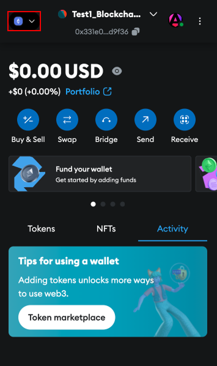
3. Add Custom Network
   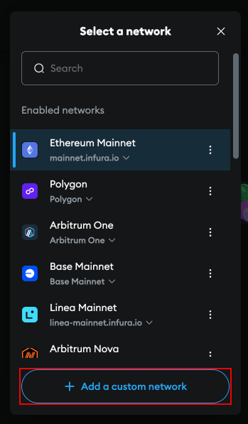
4. (Optional) Create API-KEY for infura
   Follow steps on infura.io
5. Insert the following values (Sepolia and Hardhat):
   **Network name**: Sepolia
   **Default RPC URL**: https://sepolia.infura.io/v3/<YOUR-API-KEY\>
   **Chain ID**: 11155111
   **Currency Symbol**: SepoliaETH
   **Block explorer URL**: https://sepolia.etherscan.io<br><br>

   **Network name**: Hardhat
   **Default RPC URL**: http://127.0.0.1:8545/
   **Chain ID**: 31337
   **Currency Symbol**: HardhatETH
   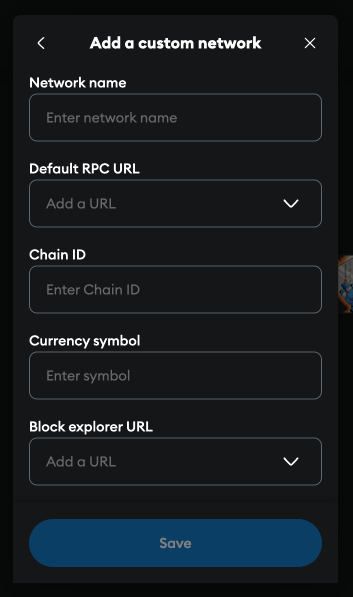

## Changing Network in MetaMask

1. Open MetaMask
   
2. Click on Network
   
3. Select desired Network

## Test Account

**Owner**: 0x331e0f477Be71d74228469a3fEF83C50B2Fd9f36
**Private Key**: 91bdcd57bc7bb18114c37b781bfb16ea2b3aee55d075e2d7229620c00de753ce

## Hardhat Accounts

**Account #0**: 0xf39Fd6e51aad88F6F4ce6aB8827279cffFb92266 (10000 ETH)
**Private Key**: 0xac0974bec39a17e36ba4a6b4d238ff944bacb478cbed5efcae784d7bf4f2ff80

**Account #1**: 0x70997970C51812dc3A010C7d01b50e0d17dc79C8 (10000 ETH)
**Private Key**: 0x59c6995e998f97a5a0044966f0945389dc9e86dae88c7a8412f4603b6b78690d

**Account #2**: 0x3C44CdDdB6a900fa2b585dd299e03d12FA4293BC (10000 ETH)
**Private Key**: 0x5de4111afa1a4b94908f83103eb1f1706367c2e68ca870fc3fb9a804cdab365a

**Account #3**: 0x90F79bf6EB2c4f870365E785982E1f101E93b906 (10000 ETH)
**Private Key**: 0x7c852118294e51e653712a81e05800f419141751be58f605c371e15141b007a6

**Account #4**: 0x15d34AAf54267DB7D7c367839AAf71A00a2C6A65 (10000 ETH)
**Private Key**: 0x47e179ec197488593b187f80a00eb0da91f1b9d0b13f8733639f19c30a34926a

## Problems in Hardhat

1.  #### IGN405 Error while deploying

    When deploying new smart contracts, this error might occur. This is a hardhat issue, as there are multiple transactions happening while deploying.
    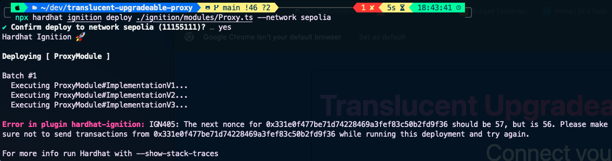

    Retry deploying, you will see a slight change in the message, stating `Resuming existing deployment from ./ignition/deployments/chain-11155111`
    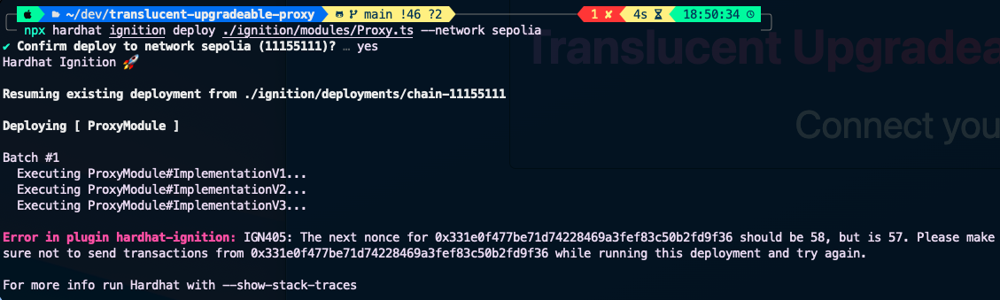

    Retry until the deployment is successful
    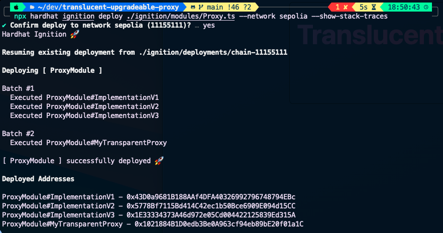

2.  #### Invalid Block Tag

    If a problem occurs and a message similar to this appears in the blockchain terminal window:

    `Received invalid block tag xx. Latest block number is zz`

    All connected wallets should then delete the activity data, then disconnect and then restart the browser. This can happen because Metamask caches a different version of the blockchain, which is then reset.

    The following error then appears in the Chrome Developer Tools:

    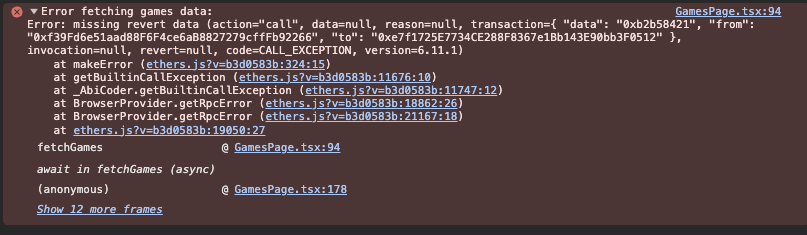

3.  #### Transaction nonce not synchronized

    If the local blockchain is used, Metamask may have a problem with the transaction nonces not being synchronized with the local blockchain. To do this, it is necessary to delete the activity data before a transaction is carried out.

#### Clear activity data in Metamask

1. Open Metamask
   
2. Click three dots
   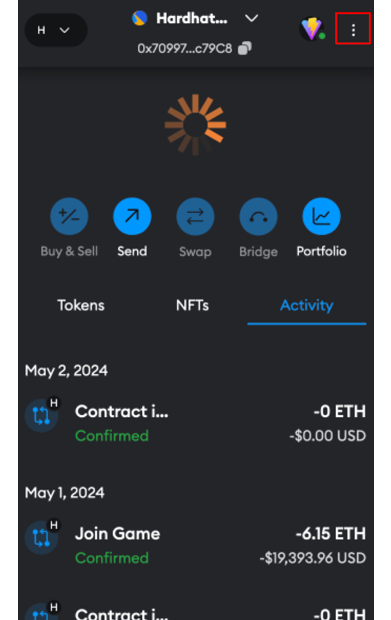
3. Open Settings
   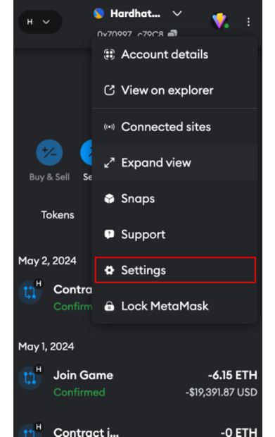
4. Open Advanced Settings
   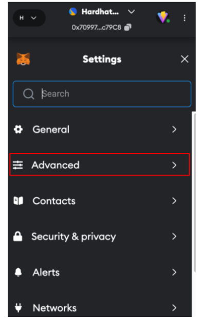
5. Click Clear activity tab data
   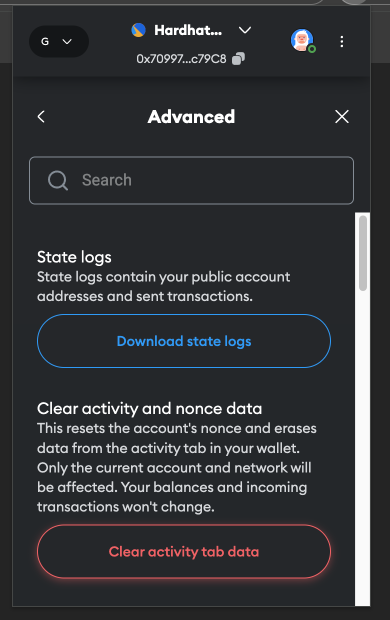

These steps must be performed for all wallets that have already signed a transaction.

#### Import account into Metamask

1. Open Metamask
   
2. Click on account
   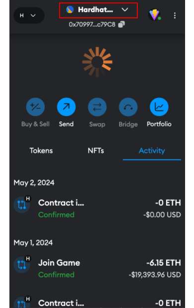
3. Click Add account or hardware wallet
   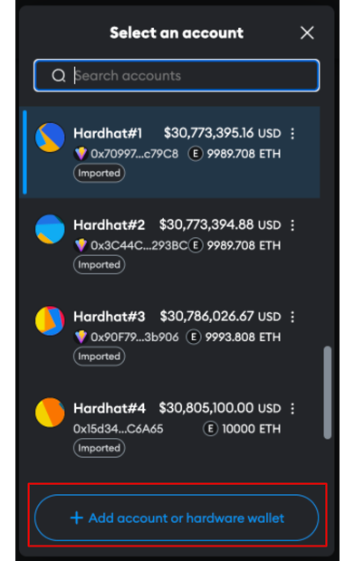
4. Import account
   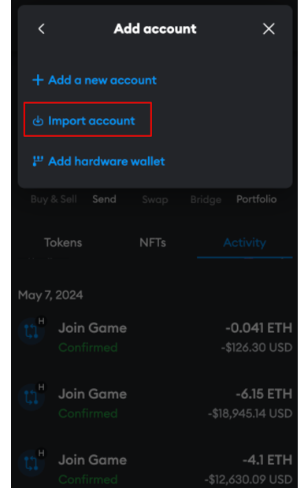
5. Insert and import private key
   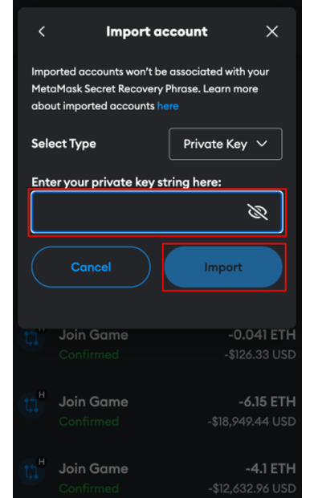
